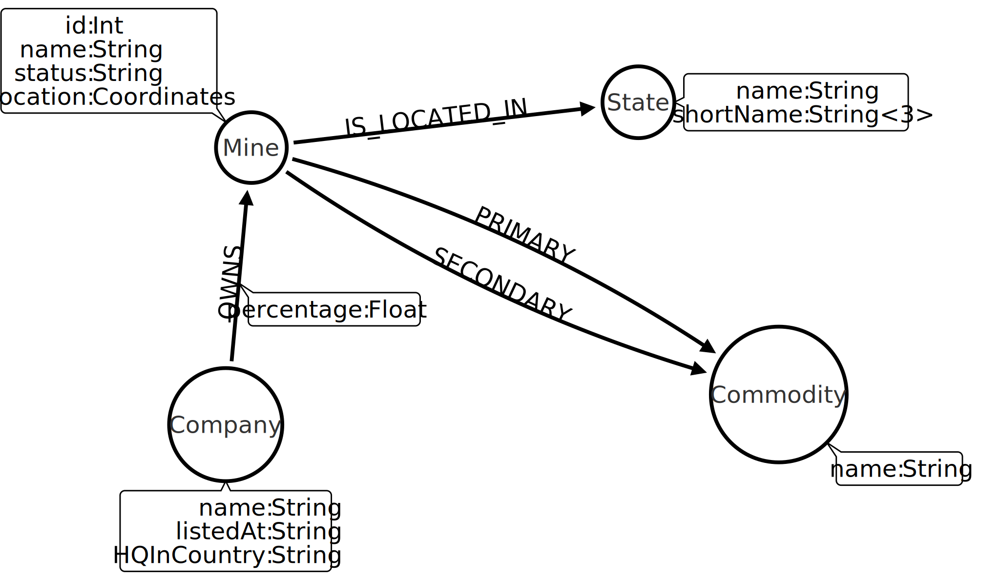

# AustralianMines
This is documentation for analyzing data about Australian mines



## Where to get the data

The mine and mineral data can be downloaded from AUSGIN Geoscience Portal at http://portal.geoscience.gov.au
The mine data can be found by choosing "Add Data" then under "Mines and Mining Activity" select "Mines (new version)", select only "Geoscience Australia" and download the data
The mineral data can be found by choosing "Add Data" then under "Mineral Occurrences and Resources", select "Mineral Occurrences (new version), select only "Geoscience Australia" and download the data.

What about production data
The state data
The company data

## Steps to prepare the data for Neo4j

Currently the following steps are done for the data downloaded from AUSGIN using Trifacta (free online version). I will add other method for preparing the data for example using Python and Panda

### Steps needed:
* From both data sets, create a new id column by extracting 6-digit id from column "gml:id". This id is more reliable for joining the data sets than the mine names
* Join the two datasets to a single file using the id-key generated above. There are plenty of empty colums and duplicate columms, which can be dropped
* There are a lot rows which are not that interesting for mine analysis. Use column erl:status to drop such rows ("historic mine" and "mineral deposit") - this will remove roughly 3500 rows from the data set leaving a little over 500 rows
* There are multiple items on certain cells on the following colums ("erl:owner", "erl:commodity"). There are quotation marks around those cells. Drop those. Also change the item delimiter in those cells from "," to ";"
* There are both primary commodities and secondary products listed in column "erl:commodity". The secondary commodities are wrapped with parenthesis. Split the column in two using delimiter ";(". Name the first column to "PrimaryCommodities" and the second "SecondaryCommodities". Remove the trailing ")" from the column "SecondaryCommodities"

## Steps to import the CSV data to Neo4j

The following brute-force method of importing the data need polishing, but it gets the job done. I will work on improving the process.
The assumption is that you have either Neo4j desktop client installed or you are using some online storage to host your Neo4j database. The prerequisite is that you have a running, emtpty instance of Neo4j database.
1. Copy your csv-file to the Import-directory of your database and name the file "output.csv"
2. Create the mines
```
LOAD CSV WITH HEADERS FROM 'file:///output.csv' AS row
WITH row
MERGE (m:Mine {name: row["erl:name"], id: row["mineId"], status: row["erl:status"], location: row["erl:shape"], geology: row["erl:geologicHistory"]})
```
3. Create the primary production commodities and the relationships
```
LOAD CSV WITH HEADERS FROM 'file:///output.csv' AS row
WITH row, SPLIT(row.PrimaryCommodities, ";") AS primaries
UNWIND primaries AS primary
MATCH (m:Mine) WHERE m.id = row.mineId
FOREACH (ignoreMe in CASE WHEN exists(row.PrimaryCommodities) THEN [1] ELSE [] END | MERGE (c:Commodity {name:primary}) MERGE (m)-[:PRIMARY]->(c))
```
4. Create the secondary production commoditions and the relationships
```
LOAD CSV WITH HEADERS FROM 'file:///output.csv' AS row
WITH row, SPLIT(row.PrimaryCommodities, ";") AS primaries
UNWIND primaries AS primary
MATCH (m:Mine) WHERE m.id = row.mineId
FOREACH (ignoreMe in CASE WHEN exists(row.PrimaryCommodities) THEN [1] ELSE [] END | MERGE (c:Commodity {name:primary}) MERGE (m)-[:PRIMARY]->(c))
```
5. Create the companies and ownership relations
```
LOAD CSV WITH HEADERS FROM 'file:///output.csv' AS row
WITH row, SPLIT(row["erl:owner"] , ";") AS owners
UNWIND owners AS owner
MATCH (m:Mine) WHERE m.id = row.mineId
FOREACH (ignoreMe in CASE WHEN exists(row["erl:owner"]) THEN [1] ELSE [] END | MERGE (c:Company {name:owner}) MERGE (c)-[:OWNS]->(m))
```
6. The previous three statements created a Commodity and Company node with no name. Delete those entities (and the relationships they have)
```
MATCH (c:Commodity) WHERE c.name = "" DETACH DELETE c
MATCH (c:Company) WHERE c.name = "" DETACH DELETE c
```
